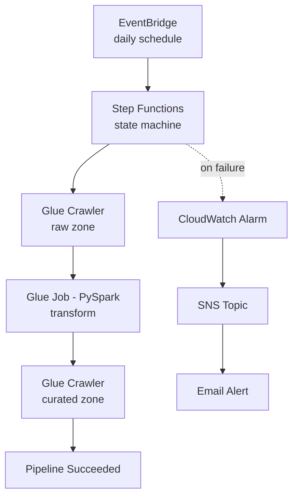
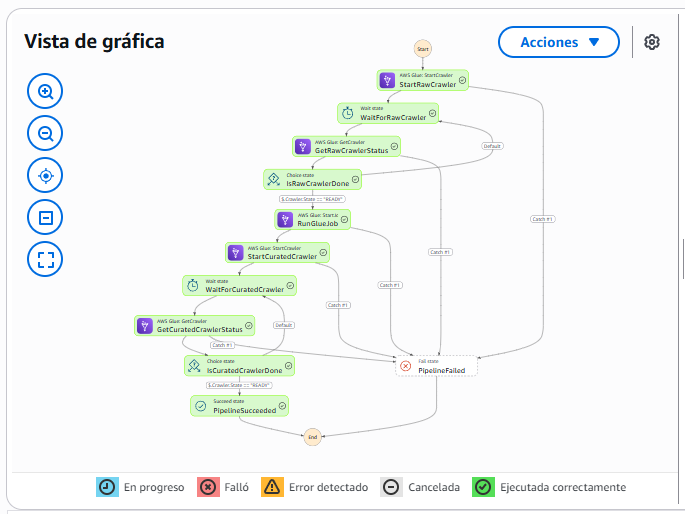
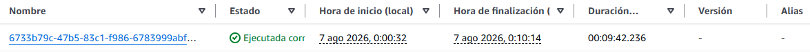
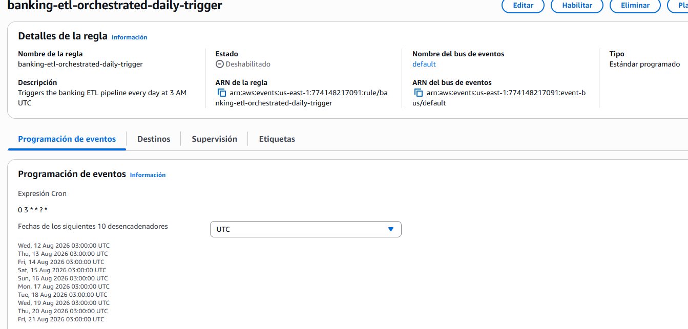

# Banking ETL Pipeline on AWS — Orchestrated & Infrastructure-as-Code

Automated, production-style version of my banking ETL pipeline: infrastructure fully managed by **Terraform**, orchestrated end-to-end with **Step Functions**, scheduled daily via **EventBridge**, and monitored with **CloudWatch/SNS** failure alerts.

This project evolves [banking-etl-aws-pipeline](https://github.com/igonzalezcamo-gh/banking-etl-aws-pipeline) — a manually-built pipeline using the same AWS services — into a system that runs itself, with no manual intervention required after deployment.

**What this demonstrates:**
- Infrastructure-as-Code with Terraform (18 resources, fully reproducible)
- Multi-step workflow orchestration with error handling (Step Functions)
- Automated daily scheduling (EventBridge) — validated with a real, unattended execution
- Failure alerting via CloudWatch + SNS email notifications
- Basic CI/CD: GitHub Actions validates Terraform syntax on every push

## Architecture



All infrastructure above (S3, IAM roles, Glue resources, Step Functions, EventBridge, CloudWatch, SNS) is defined in Terraform — nothing was created manually in the AWS console.

## Proof: Fully Automated Execution

The state machine orchestrates all 5 steps (raw crawler → wait/poll → Glue job → curated crawler → wait/poll) with automatic error handling via `Catch` blocks on every step:



**EventBridge trigger validated live**: the rule below fired the pipeline automatically at 00:00 Argentina time (03:00 UTC), with no manual command run — confirmed by the execution timestamp:



```
7 ago 2026, 0:00:32 — execution started automatically, no manual `start-execution` call
```

**Rule configuration** (currently disabled to avoid ongoing costs — see note below):



## Tech Stack

| Service | Purpose |
|---|---|
| Terraform | Infrastructure as Code — all 18 resources below are defined and reproducible |
| AWS Step Functions | Orchestrates the crawler → job → crawler sequence with retry/error handling |
| Amazon EventBridge | Triggers the pipeline automatically on a daily schedule |
| Amazon CloudWatch | Alarm on `ExecutionsFailed` metric from the state machine |
| Amazon SNS | Email notification channel for pipeline failures |
| AWS Glue (Crawler + Job) | Same transformation logic as the manual project, now Terraform-managed |
| Amazon S3 | Data lake storage (raw/curated), encrypted, public access blocked |
| IAM | Three scoped roles: Glue, Step Functions, EventBridge — each with only the permissions it needs |
| GitHub Actions | CI check: `terraform fmt` + `terraform validate` on every push |

## Design Decisions & Trade-offs

**Terraform state stored locally, not in a remote backend.** In a team environment, `terraform.tfstate` would live in a remote backend (S3 + DynamoDB for locking) so multiple people can collaborate safely and the state survives a lost laptop. For this single-developer portfolio project, local state was a deliberate simplification — documented here as a known gap, not an oversight.

**IAM policy for Step Functions → Glue uses `Resource = "*"`.** Unlike the S3 policy (scoped to one specific bucket ARN), Glue crawler/job actions can't be easily restricted to individual resource ARNs in the same way. This was a conscious trade-off: broader permissions in exchange for a policy that's actually implementable without excessive complexity.

**Data ingestion into `raw/` is manual, not automated.** This project automates orchestration and processing, not the initial ingestion step — the sample CSV is uploaded manually to simulate a source system landing data in S3. In a production setting, this would typically be handled by an upstream system (a core banking export, an API, or a streaming source) writing directly to `raw/`, which could then trigger this pipeline via S3 event notifications instead of (or in addition to) the daily schedule.

**Separate infrastructure from the manual project.** This project uses its own S3 bucket and Glue database, entirely independent from [banking-etl-aws-pipeline](https://github.com/igonzalezcamo-gh/banking-etl-aws-pipeline) — avoiding any conflict between manually-created resources and Terraform-managed state.

## IAM Permissions — Built Incrementally

The working AWS user's permissions grew one service at a time, as each part of the pipeline was built — reflecting how a real project's access needs are typically discovered progressively rather than fully predicted upfront:

| Permission | Needed for |
|---|---|
| `AmazonS3FullAccess`, `AWSGlueConsoleFullAccess`, `AmazonAthenaFullAccess` | Base services (inherited from the manual project) |
| `IAMFullAccess` | Terraform creating IAM roles/policies on your behalf |
| `AWSStepFunctionsFullAccess` | Creating and running the state machine |
| `CloudWatchEventsFullAccess` | Creating the EventBridge schedule |
| `AmazonSNSFullAccess`, `CloudWatchFullAccess` | Failure alerting (topic + alarm) |

The three IAM roles *created by Terraform* for the pipeline itself (Glue, Step Functions, EventBridge) are scoped far more tightly than this working-user account — each can only do what its specific task requires, following least-privilege principles.

## CI/CD

A GitHub Actions workflow (`.github/workflows/terraform-validate.yml`) runs on every push to `main`:
- `terraform fmt -check` — enforces consistent formatting
- `terraform validate` — catches syntax errors and broken resource references

Deliberately does **not** run `terraform apply` in CI — deploying infrastructure automatically from a public repo would require storing AWS credentials in GitHub, which is avoided here. In a team setting with proper secret management (OIDC federation, restricted IAM roles), this would be the natural next step toward full CI/CD.

## Cost Management

Same discipline as the manual project: built and tested under a **$15/month AWS Budget alarm** (70/90/100% thresholds). Approximate costs while the schedule is active:

| Resource | Cost |
|---|---|
| Glue Job (2 DPU, ~4 min/run) | ~$0.06/day |
| 2 Glue Crawlers (10-min minimum billing each) | ~$0.30/day |
| CloudWatch Alarm | ~$0.10/month (flat) |
| SNS, EventBridge | Free tier |

Running daily, this adds up to roughly **$10–12/month** if left unattended — which is why the schedule is currently disabled between demonstrations (`aws events disable-rule`), with zero cost impact on the rest of the infrastructure.

## Repository Structure

```
banking-etl-orchestrated-pipeline/
├── main.tf                          # All AWS resources (18 total)
├── provider.tf                      # AWS provider configuration
├── variables.tf                     # Configurable parameters
├── terraform.tfvars                 # Local-only, gitignored (contains alert email)
├── glue_jobs/
│   └── transform_transactions.py    # Same transformation logic as the manual project
├── step_functions/
│   └── pipeline.asl.json            # State machine definition (Amazon States Language)
├── .github/workflows/
│   └── terraform-validate.yml       # CI: fmt + validate on every push
├── docs/images/                     # Screenshots referenced in this README
└── README.md
```

## Traditional ETL vs. This Project — Mapping

| Traditional / Manual (PowerCenter, Ab Initio, or Project 1) | This project |
|---|---|
| Resources created by hand in a console | Terraform-managed, versioned, reproducible |
| Manual job scheduling / cron on a server | EventBridge |
| Manual step-by-step execution and monitoring | Step Functions orchestration with automatic retries |
| Checking logs manually after a failure | CloudWatch alarm + automatic email notification |

## What's Next

- Remote Terraform state backend (S3 + DynamoDB) — currently local, documented as a known gap
- Automated `terraform apply` in CI/CD via OIDC federation, once proper secret management is in place
- Unit tests for the PySpark transformation logic
- S3 event notification to trigger ingestion-to-processing automatically, reducing reliance on the daily schedule alone

## Author

Built by [Ivan Gonzalez Camo](https://www.linkedin.com/in/ivan-gonzalez-camo/) as part of a hands-on transition from traditional ETL tooling (Ab Initio) into AWS-native, infrastructure-as-code data engineering.